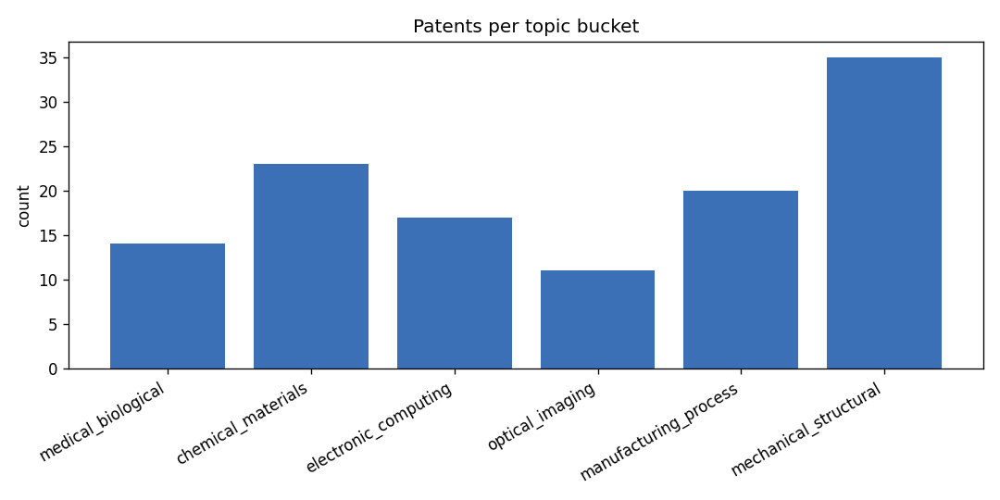
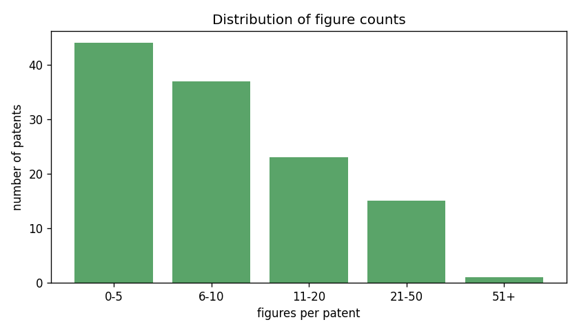
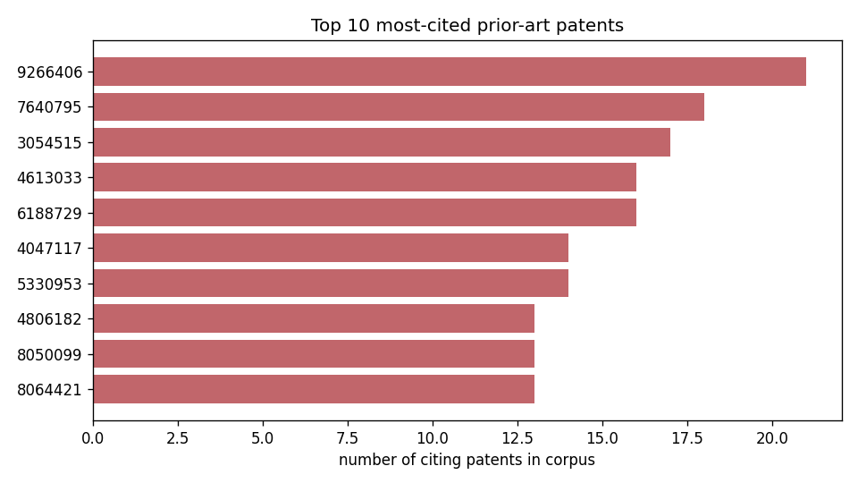

# Patent Corpus Analytics

[](https://www.python.org/)
[](#testing)
[](LICENSE)

A reproducible pipeline that turns a corpus of raw patent text into a structured
analytics report: per-document metrics, a deterministic seven-bucket topic
classification, corpus-level statistics, and a full cross-corpus **citation
graph** of the prior art. It ships with a synthetic patent generator so the
whole thing runs end to end on any machine with no external data.

The design separates the probabilistic-looking problem (reading messy documents)
from deterministic, testable code: text in, regex and rule based extraction,
pure-Python aggregation, verified against ground truth.

```
generate ─▶ extract ─▶ classify ─▶ aggregate ─▶ output.json + charts
 (text)     (regex)    (rules)     (stats+graph)
```

## Why it exists

Patent portfolios are large, noisy, and inconsistently formatted. Answering
simple portfolio questions ("which prior art is cited most across our filings?",
"how do figure counts vary by technology area?") means parsing hundreds of
documents the same way every time. This project does that deterministically and
proves the parser is correct by checking it against a known ground truth.

## What it computes

**Per patent** (`patents[]` in the output): `doc_id`, `figure_count`,
`claim_count`, `citation_count`, `cited_patents`, `filing_type`
(original vs continuation-in-part), `primary_material`, and `topic`.

**Corpus aggregations** (`aggregations` in the output, 26 keys), including:

- Topic distribution across 7 buckets (counts sum to the corpus size).
- Descriptive statistics: figure-count standard deviation, citation mean and
  median, max figure count and the patent that holds it.
- Group-by means and totals by topic (figures and citations).
- A binned figure-count histogram (`0-5`, `6-10`, `11-20`, `21-50`, `51+`).
- A figure-vs-citation Spearman rank-correlation sign.
- Continuation-in-part counts and CIP vs non-CIP citation means.
- A cross-corpus **citation graph**: for every cited US patent number, how many
  corpus documents cite it, the most-cited number, and the count of shared
  prior art (cited by two or more documents).

## Example results

Running on the bundled 120-patent synthetic corpus (seed 42):

| Metric | Value |
|---|---|
| Patents analyzed | 120 |
| Distinct US prior-art patents cited | 130 |
| Shared prior art (cited by 2+ patents) | 75 |
| Most-cited prior art | `9266406` (cited by 21 patents) |
| Continuation-in-part filings | 25 |
| Max figure count | 74 (`patent_B_105`) |
| Figure-count standard deviation | 12.44 |
| Topic with highest mean figures | `medical_biological` |

<p align="center">
  
  
</p>
<p align="center">
  
</p>

A full sample report is committed at [`examples/output.json`](examples/output.json).

## Quickstart

```bash
git clone https://github.com/<you>/patent-corpus-analytics.git
cd patent-corpus-analytics
pip install -e ".[dev]"

# Generate a corpus, analyze it, and render charts in one go:
patent-analytics all

# Or step by step:
patent-analytics generate --count 120 --seed 42
patent-analytics analyze --output examples/output.json
patent-analytics report  --charts-dir examples/charts
```

### Use it on real patents

Point the analyzer at any folder of `.txt` patent files (one document per file);
no generation step required:

```bash
patent-analytics analyze --data-dir /path/to/your/patents/.. --output report.json
```

The extractor relies only on common patent conventions (`U.S. Pat. No. ...`,
`FIG. N`, `What is claimed is:`, `continuation-in-part`), so it works on real
filings, not just the synthetic corpus.

## Library API

```python
from patent_analytics import extract_corpus, aggregate, build_output

records = extract_corpus("data/patents")
report  = aggregate(records)
full    = build_output("data/patents")   # {"patents": [...], "aggregations": {...}}
```

## How correctness is verified

The synthetic generator records a `ground_truth.json` describing exactly what it
wrote into each document (figure count, claim count, the set of cited numbers,
filing type, material). The test suite regenerates a corpus and asserts that the
**independent** text extractor recovers that ground truth field for field. This
turns "does the parser work?" into a deterministic, repeatable check.

## Testing

```bash
pytest -q
```

```
13 passed
```

Coverage spans extraction-vs-ground-truth, the topic priority chain, the
aggregation math (histogram bins, citation graph, CIP means, rank-correlation
sign), and generator reproducibility.

## Project layout

```
src/patent_analytics/
  generate.py    synthetic corpus generator (+ ground truth)
  extract.py     text -> structured PatentRecord (regex based)
  classify.py    deterministic 7-bucket topic classification
  aggregate.py   corpus statistics + citation graph
  visualize.py   matplotlib charts
  pipeline.py    extract -> classify -> aggregate -> output.json
  cli.py         `patent-analytics` command
tests/           pytest suite (extraction, classification, aggregation)
examples/        committed sample output.json and charts
```

## License

MIT. See [LICENSE](LICENSE).
